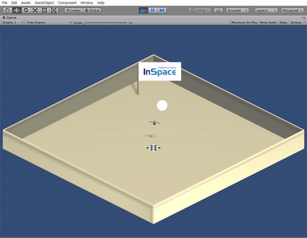
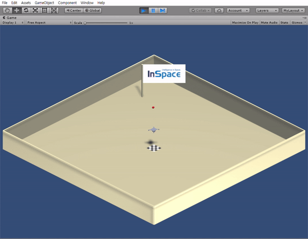

# **Unity Drone Environment for RL**

 

## **About**

There are drone environments made in **Inspace**. You can test your algorithm in these environments  with default settings. Besides, you can modify some settings(state, action, reward, ...) too. Mostly modify within *DroneAgent.cs* script file. And You can make any environments with this drone agent.

## **Environment** 

* Windows10 64bit
* Unity 2018.3.8f2 Personal
* Unity ML-Agents v0.7
* VisualStudio 2017

## **Drone Flight Env**

### Goal
 - To reach the white ball
 
### State
 - Vector from drone to ball
 - Up-vector of drone
 - Front-vector of drone
 - Velocity vector of drone
 - Angular velocity vector of drone

### Action
 - Value of each propellers lift

### Reward
 - Δ(Distance from Drone to ball)

## **Drone Juggling Env**

### Goal
 - To do not miss the red ball while flying

### State
 - Vector from drone to ball
 - Vecotr from current drone position to drone initial position
 - Up-vector of drone
 - Front-vector of drone
 - Velocity vector of drone
 - Angular velocity vector of drone
 - Normalized vector of Δ(ball position)
 
### Action
 - Value of each propellers lift

### Reward
 - y-axis value of up-vector / CONSTANT
 - 1 / (CONSTANT + distance from current drone position to drone initial position)
 - 1 / (CONSTANT + distance from current ball position to ball initial position)

## **Getting Started**

### RL algorithm test
 You can test your algorithm in *notebooks/getting-started.ipynb*.

### Player Control
 You can play these environments in *play/DRONEENV/DRONEENV.exe* 

| *Keyboard Key* | *Action* |
| --- | --- |
| Q | Add propulsion to the first propeller.  |
| W | Add propulsion to the second propeller |
| A | Add propulsion to the third propeller |
| S | Add propulsion to the fourth propeller |